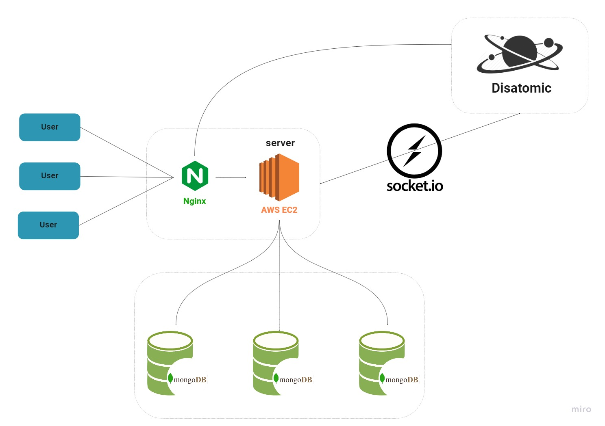

**<p align="center">A minimal online chat service, and provided both website and cross-platform desktop application with <a href="https://www.electronjs.org/">Electron</a>.</p>**

## Disatomic

- [Website](https://dis4tomic.com)
- [Front-End Repo](https://github.com/HackHow/Disatomic-React)
- [Demo Video](https://drive.google.com/file/d/1x9eUrFunTPjnNZyUa8nAw0Lkrj1JphJY/view)

## Table of Contents

- [Motivation](https://github.com/HackHow/Disatomic-server/tree/develop#Motivation)
- [Tech Stack](https://github.com/HackHow/Disatomic-server/tree/develop#Tech-Stack)
- [Features](https://github.com/HackHow/Disatomic-server/tree/develop#Features)
- [Try Out](https://github.com/HackHow/Disatomic-server/tree/develop#Try-Out)
- [Architecture](https://github.com/HackHow/Disatomic-server/tree/develop#Architecture)
- [Contact](https://github.com/HackHow/Disatomic-server/tree/develop#Contact)

## Motivation

I want to create a chat room that automatically stores files and links because the primary communication platform is Discord in the training camp, where students and teachers frequently share specific technical articles or files. Still, I can't find something quickly in the chat room when I want to find something. It is not easy to access files or web links that have already been sent.

## Tech Stack


## Features

- Stored automaitcally files and links in chat room
- Created Workspaces and channels
- Cross-platform desktop applications
- Identified text containing http or https and turn it into a link
- Previewed user-uploaded images
- Real-time notification mechanism

## Try Out

Provide three sets of test accounts to users. Through these test accounts, you can add friends and private messages and create multi-person chat rooms. In addition, users can also register a new account.

_user1_

```
email: demo1@test.com
password: 123456
```

_user2_

```
email: demo2@test.com
password: 654321
```

_user3_

```
email: demo3@test.com
password: abcdef
```

## Architecture



## Contact
If you have some suggestions or feedback, please get in touch with me.


<a href="mailto:howardshen2306@gmail.com" ref="nofollow"></a>

<a href="https://www.linkedin.com/in/howardshen23/" rel="nofollow"></a>
